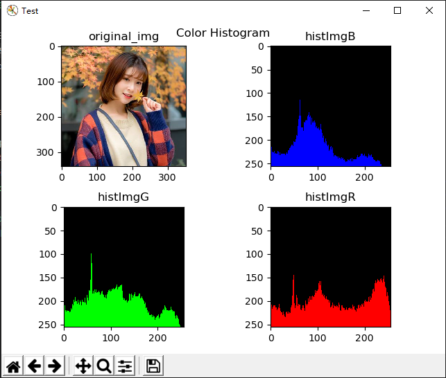
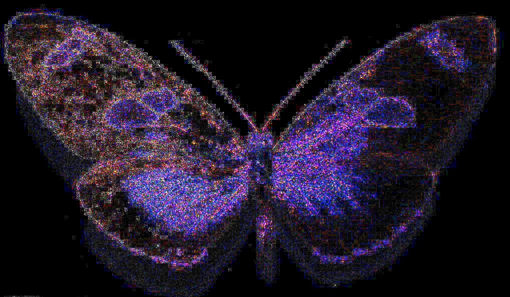
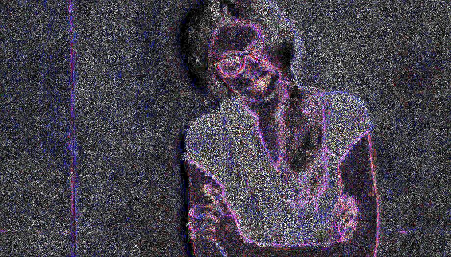
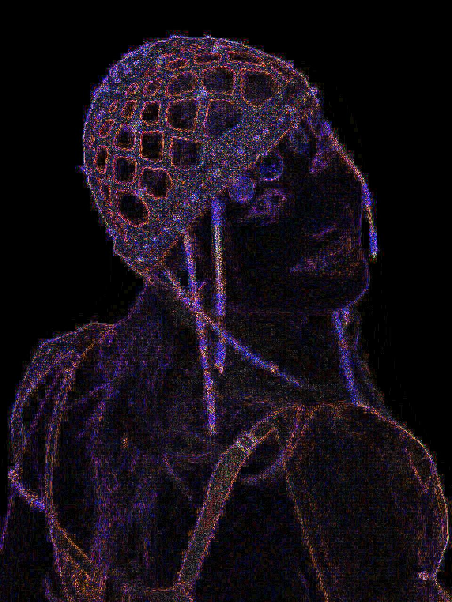
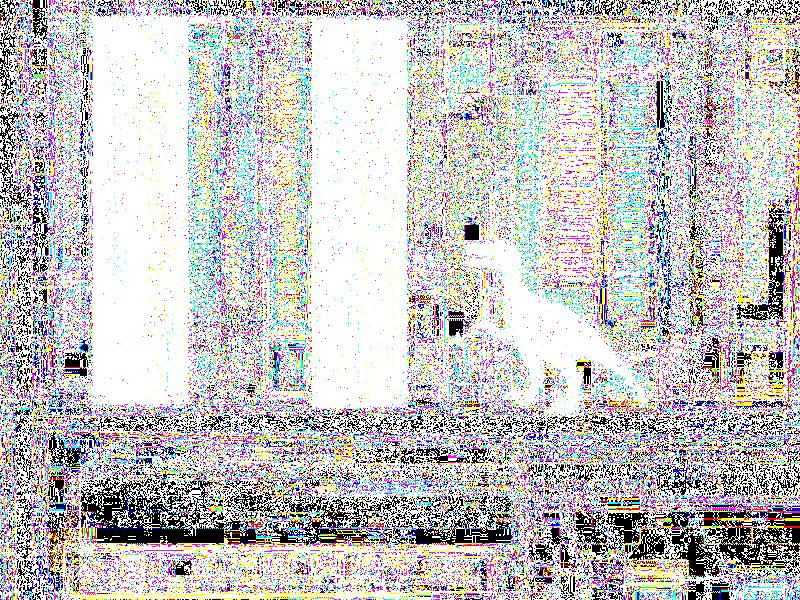

# 针对Deepfake假脸视频面部细节特征的提取算法

## 目录

- [仓库说明](#一仓库说明)
- [工作计划](#二工作计划)
- [调研和资料分析](#三调研和资料分析)
- [学习特征提取](#四学习特征提取)
- [数据库预处理](#五数据库预处理)
- [提取特征并检测GAN真假脸差异](#六提取特征并检测GAN真假脸差异)
- [Deepfake换脸检测算法实现](#七Deepfake换脸检测算法实现)
- [完成论文](#八完成论文)

## 一、仓库说明

```bash
.
│  LICENSE                # 许可说明
│  README.md              # 说明文件
│
├─Preparation             # 阅读相关论文，Python学习，环境准备工作
├─FeatureExtraction       # 学习特征提取 代码文件夹
├─DatabasePreprocessing   # 数据库预处理，提取人脸  代码文件夹
├─DetectGANDifferences    # 提取特征并检测GAN真假脸差异  代码文件夹
├─DeepfakeDetection       # 算法实现 Deepfake 换脸检测  代码文件夹
└─Paper                   # 我的论文
```

## 二、工作计划

### 1.数据库分配

学生 | 真脸 | GAN假脸数据库 | Deepfake数据库
-|-|-|-
JYT | FFHQ(0-35000) | styleGAN2 | TIMIT
XJ | Celeba(train) | styleGAN | DFDC
ZS | FFHQ(35001-70000) | starGAN | faceforensic
Allenem | Celeba(validation,test) | PGGA | DeepfakeDetection

### 2.特征分配

学生 | 特征
-|-
JYT | 1、局部二值模式LBP 2、方向梯度直方图HOG 3、SRM残差图像
XJ | 1、共生矩阵 2、光流场 3、LPQ特征
ZS | 1、直方图/共生矩阵 2、拉普拉斯变换均方差 3、小波变换频率直方图
Allenem | 1、颜色直方图 2、Surf 3、错误级别分析（Error level analysis，ELA）

### 3.工作计划

起止时间 | 工作内容 | 备注
-|-|-
2020.01-2020.02 | 调研和资料分析 | 	
2020.01-2020.02	| 数据库预处理 | 视频分帧、人脸提取及定位
2020.02-2020.03 | 提取人脸特征、检测GAN真假脸图像差异 | 隐写分析特征或者图像篡改特征
2020.03-2020.04 | Deepfake换脸视频检测算法实现 | SVM分类器等不同分类器
2020.04-2020.05 | 完成毕业论文 |

## 三、调研和资料分析

### 1.参考文献

[[1] Generative Adversarial Networks](https://arxiv.org/pdf/1406.2661.pdf)

[[2] Deepfake Video Detection through Optical Flow Based CNN](openaccess.thecvf.com/content_ICCVW_2019/papers/HBU/Amerini_Deepfake_Video_Detection_through_Optical_Flow_Based_CNN_ICCVW_2019_paper.pdf)

[[3] Exposing deep fakes using inconsistent head poses](https://arxiv.org/pdf/1811.00661.pdf)

[[4] Exposing GAN-synthesized Faces Using Landmark Locations](https://arxiv.org/pdf/1904.00167.pdf)

[[5] Perceptual Judgments to Detect ComputerGenerated Forged Faces in Social Media](https://kopernio.com/viewer?doi=10.1007/978-3-030-20984-1_4&token=WzE3MDUwMzYsIjEwLjEwMDcvOTc4LTMtMDMwLTIwOTg0LTFfNCJd.EPCnRwtIa113H6qoV-aTHHQoOOs)

参考文件夹 `Preparation`

### 2.我自己的中文翻译

参考文件夹 `Preparation`

### 3.Python学习和人脸检测学习

学习笔记： https://github.com/Allenem/GitHubNoteBook#python

OpenCV，dlib，face_recognition 实现人脸检测，标志检测等实验小测试： https://github.com/Allenem/PyTest

## 四、学习特征提取

>学习参考：   
>https://blog.csdn.net/wsp_1138886114/article/details/80660014   
>https://www.jianshu.com/p/38da7d6cb89d   
>https://blog.csdn.net/u010454030/article/details/80312809   
>https://blog.csdn.net/qq_43443531/article/details/93043212   
>https://www.jianshu.com/p/bd12c4273d7d

### 1、颜色直方图 

#### 1.1 matplotlib画图像变色问题

在使用opencv配合jupyter notebook调试，其中常常使用matplotlib来显示图像

```py
import cv2    
import numpy as np
import matplotlib.pyplot as plt
image = cv2.imread("image.jpg") 
# 后面的方法都从此处开始更改
plt.subplot(),plt.imshow(image),plt.title('Input')
plt.show()
```

但是在实际使用过程中，我们会发现plt.imshow()后出现的图形变成了负片，这是因为cv2.imshow()与plt.imshow()的通道顺序不同产生的，前者BGR，后者RGB。

解决方法一：

```py
b, g, r = cv2.split(image)
image_new = cv2.merge([r, g, b])
plt.subplot(),plt.imshow(image_new),plt.title('Input')
plt.show()
```

解决方法二：

```py
image_new = np.flip(original_img,axis = 2)
plt.subplot(),plt.imshow(image_new),plt.title('Input')
plt.show()
```

解决方法三：

```py
image_new = image[:,:,::-1]
plt.subplot(),plt.imshow(image_new),plt.title('Input')
plt.show()
```

当然cv2自己显示没有问题，它的颜色顺序是BGR

```py
import cv2    
import numpy as np
image = cv2.imread("image.jpg") 
cv2.imshow("Img", image)  
cv2.waitKey(0)  
cv2.destroyAllWindows() 
```

#### 1.2 histogram.py 和 histogram3lines.py 效果图 




### 2、Surf 

>学习参考：   
>https://blog.csdn.net/qq_37764129/article/details/80969515  
>https://blog.csdn.net/Allyli0022/article/details/87010050   
>https://www.jianshu.com/p/14b92d3fd6f8   
>https://blog.csdn.net/ssw_1990/article/details/72789873   

#### 2.1 SURF简介

[SURF论文](https://www.vision.ee.ethz.ch/~surf/eccv06.pdf)

[OpenCV-python-Tutorial](https://docs.opencv.org/3.1.0/df/dd2/tutorial_py_surf_intro.html)

[OpenCV-python-Tutorial中文解释](https://blog.csdn.net/yukinoai/article/details/88914269)

`SURF(Speeded Up Robust Features)` 加速鲁棒特征。正如其名，它是加速版本的 `SIFT(Scale-invariant feature transform)` 尺度不变特征转换。

它善于处理具有模糊和旋转的图像，但是不善于处理视角变化和光照变化。在SIFT中使用高斯微分 `DoG(Difference of Gaussian)`  对高斯拉普拉斯算子 `LoG(Laplacian of Gaussian)` 进行近似，而在SURF中使用盒子滤波器 `Box Filter` 对 `LoG` 进行近似，这样就可以使用积分图像了（计算图像中某个窗口内所有像素和时，计算量的大小与窗口大小无关）。总之，SURF最大的特点在于采用了 **Haar特征** 以及 **积分图像** 的概念，大大加快了程序的运行效率。

#### 2.2 SURF小实验和效果图

**① 创建一个SURF对象**

`cv2.xfeatures2d.SURF_create(, hessianThreshold, nOctaves, nOctaveLayers, extended, upright)`

- hessianThreshold：默认100，关键点检测的阈值，越高监测的点越少

- nOctaves：默认4，金字塔组数

- nOctaveLayers：默认3，每组金子塔的层数

- extended：默认False，扩展描述符标志，True表示使用扩展的128个元素描述符，False表示使用64个元素描述符。

- upright：默认False，垂直向上或旋转的特征标志，True表示不计算特征的方向，False-计算方向。

之后也可以通过类似getHessianThreshold()，setHessianThreshold()等函数来获取或修改上述参数值，例如

`surf.setHessianThreshold(True)` 表示将HessianThreshold参数修改为True。

**② 绘制特征点**

`cv2.drawKeypoint(image, keypoints, outImage, color, flags)`

或：

`outImage = cv2.drawKeypoint(image, keypoints, None, color, flags)`

- image：输入图像

- keypoints：上面获取的特征点

- outImage：输出图像

- color：颜色，默认为随机颜色，顺序为BGR

- flags：绘制点的模式，有以下四种模式

  - cv2.DRAW_MATCHES_FLAGS_DEFAULT：

    默认值，只绘制特征点的坐标点,显示在图像上就是一个个小圆点,每个小圆点的圆心坐标都是特征点的坐标。

  - cv2.DRAW_MATCHES_FLAGS_DRAW_RICH_KEYPOINTS：

    绘制特征点的时候绘制的是带有方向的圆,这种方法同时显示图像的坐标,size，和方向,是最能显示特征的一种绘制方式。

  - cv2.DRAW_MATCHES_FLAGS_DRAW_OVER_OUTIMG：

    只绘制特征点的坐标点,显示在图像上就是一个个小圆点,每个小圆点的圆心坐标都是特征点的坐标。

  - cv2.DRAW_MATCHES_FLAGS_NOT_DRAW_SINGLE_POINT：

    单点的特征点不被绘制 

**③ 调试**

由于如下报错：

```bash
surf = cv2.xfeatures2d.SURF_create(30000)
cv2.error: OpenCV(4.2.0) C:\projects\opencv-python\opencv_contrib\modules\xfeatures2d\src\surf.cpp:1029: error: (-213:The function/feature is not implemented) This algorithm is patented and is excluded in this configuration; Set OPENCV_ENABLE_NONFREE CMake option and rebuild the library in function 'cv::xfeatures2d::SURF::create'
```

所以采取如下措施：

```bash
pip uninstall opencv-python 
pip uninstall opencv-contrib-python
pip install opencv-python==3.4.2.16 -i "https://pypi.doubanio.com/simple/"
pip install opencv-contrib-python==3.4.2.16 -i "https://pypi.doubanio.com/simple/"
```

**④ 代码文件** 

`./FeatureExtraction/surf.py`

**⑤ 效果图**


### 3、错误级别分析（Error level analysis，ELA）

>学习参考：   
>http://www.errorlevelanalysis.com/   
>http://fotoforensic.com/tutorial.php?tt=ela   
>https://en.wikipedia.org/wiki/Error_level_analysis   
>代码参考:   
>https://github.com/redaelli/imago-forensics/blob/master/imago/extractor.py#L71

**① 理论说明**

ELA 全称：Error Level Analysis ，汉译为“错误级别分析”或者叫“误差分析”。通过检测特定压缩比率重新绘制图片后造成的误差分布，可用于识别JPEG图片的压缩。

>Principe：Error Level Analysis (ELA) permits identifying areas within an image that are at different compression levels. With JPEG images, the entire picture should be at roughly the same level. If a section of the image is at a significantly different error level, then it likely indicates a digital modification.

原理：错误级别分析可以识别出一幅图片不同压缩率的地方。JPEG图像全图应该大约是相同的压缩率。如果图片的某一部分有非常突出的错误压缩率，则它可能被数字化更改过。

**② 编程**

为了引入magic文件类型识别，安装 `python-magic-bin` 库。

```bash
pip install -i http://mirrors.aliyun.com/pypi/simple/ python-magic-bin
```

代码文件：`./FeatureExtraction/img/ELA.py`

<details>
<summary>带注释的代码</summary>

```py
import os,sys
import magic
from PIL import Image, ImageChops, ImageEnhance


def ela(filename, output_path):
  print("****ELA is starting****")
  if magic.from_file(filename, mime=True) == "image/jpeg":
    # set tmp_image's quality_level to be resaved
    quality_level = 80
    # get fileRealName,.postfix
    (filerealname, extension) = os.path.splitext(os.path.basename(filename))
    # set tmp_image & ela_image path
    tmp_path = os.path.join(output_path,filerealname+"_tmp.jpg")
    ela_path = os.path.join(output_path,filerealname+"_ela.jpg")

    # resave image
    image = Image.open(filename)
    image.save(tmp_path, 'JPEG', quality=quality_level)


    tmp_image = Image.open(tmp_path)
    # return abs of difference
    ela_image = ImageChops.difference(image, tmp_image)
    # return (min,max) two-truples with RGB 3 elements, eg. ((0,255),(0,255),(0,255))
    extrema = ela_image.getextrema()
    # get the max of RGB max
    max_diff = max([ex[1] for ex in extrema])
    # set scale to enhance
    scale = 255/max_diff
    # 'Brightness' indicates we will brignten img
    # 'enhance' indicates the scale of brightness
    # An enhancement factor of 0.0 gives a black image. A factor of 1.0 gives the original image.
    ela_image = ImageEnhance.Brightness(ela_image).enhance(scale)

    ela_image.save(ela_path)
    os.remove(tmp_path)  # if remove this code, image will be resaved as tem_image and won't be removed.
    print("****ELA has been completed****")
  else:
    print("ELA works only with JPEG")

if __name__ == "__main__":
  filename = "./img/webOriginalImg.jpg"
  output_path = "./img"
  ela(filename, output_path)
```

</details>

**③ 原图&效果图**

第一组

原图 | ELA高亮图
-|-
 | 
 | 

第二组

原图 | 网上的ELA高亮图 | 我自己做的ELA高亮图
-|-|-
 |  | 
 |  | 

第三组

图1 | 图2 | 差别
-|-|-
 |  |  

## 五、数据库预处理


## 六、提取特征并检测GAN真假脸差异


## 七、Deepfake换脸检测算法实现


## 八、完成论文


