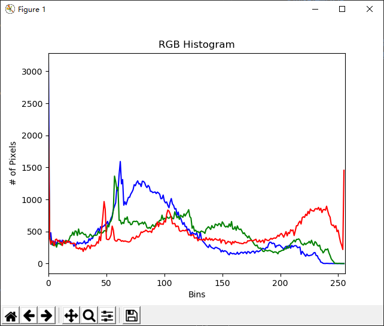
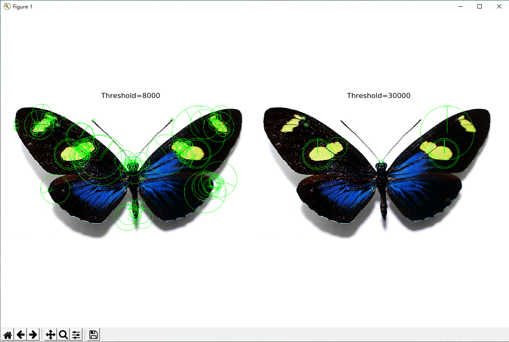
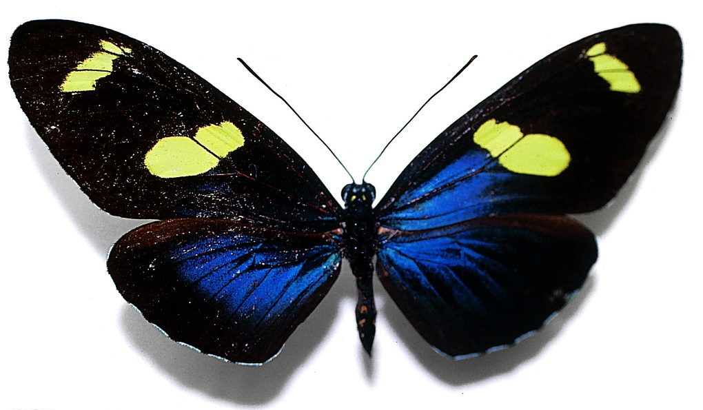
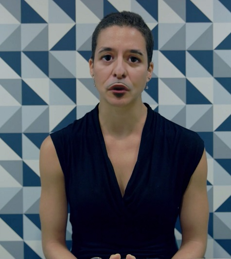
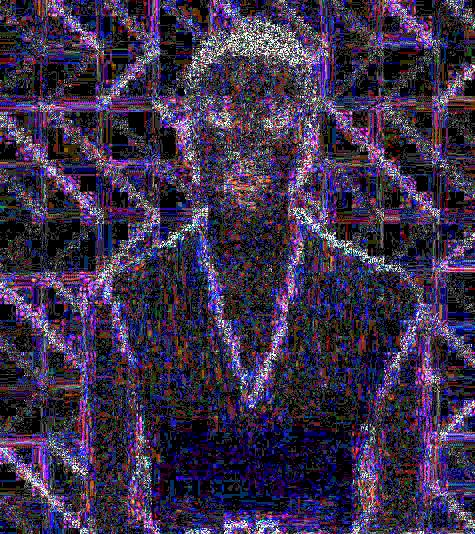
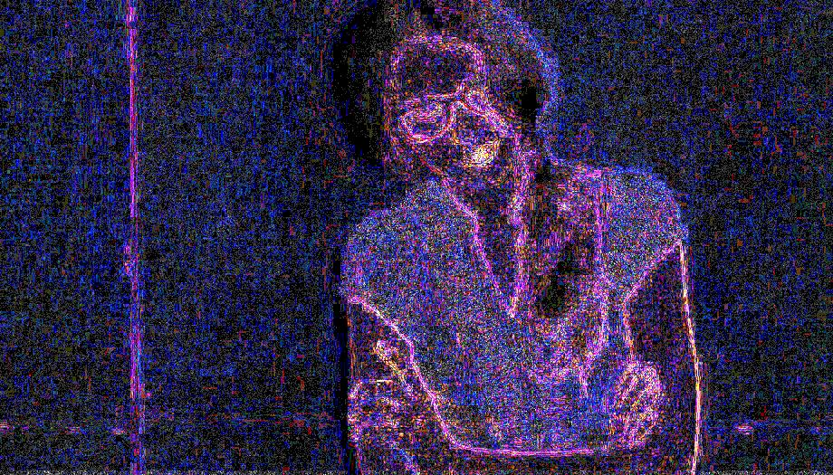
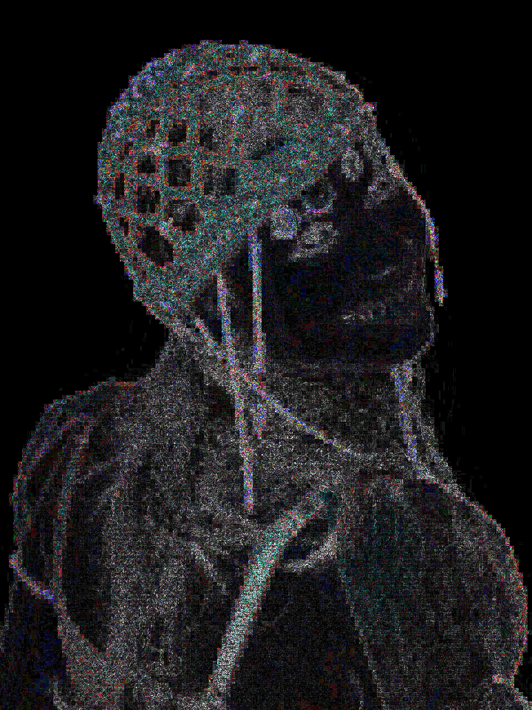
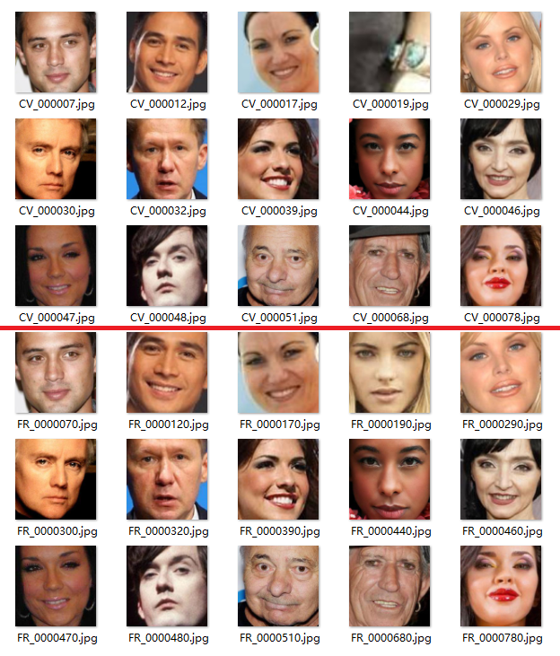
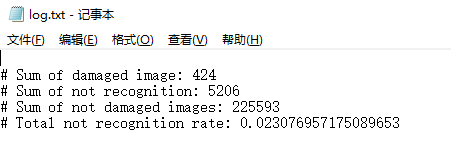
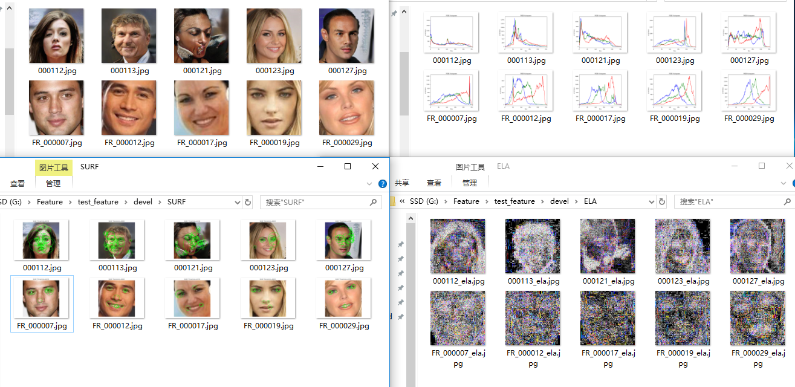

# 针对Deepfake假脸视频面部细节特征的提取算法

## 目录

- [x] [仓库说明](#一仓库说明)
- [x] [工作计划](#二工作计划)
- [x] [调研和资料分析](#三调研和资料分析)
- [x] [学习特征提取](#四学习特征提取)
- [x] [数据库预处理](#五数据库预处理)
- [x] [Celeba PGGAN DFD 数据集特征提取](#六CelebaPGGANDFD数据集特征提取)
- [ ] [完成论文](#七完成论文)

---

## 一、仓库说明

```bash
.
│  LICENSE                       # 许可说明
│  README.md                     # 简介
│
├─Preparation                    # 阅读相关论文，Python学习，环境准备工作
├─FeatureExtractionLearning      # 学习特征提取 代码文件夹
├─DatabasePreprocessing          # 数据库预处理：图片提取人脸，视频分帧存图提取人脸
├─DatabaseFeatureExtraction      # 提取 Celeba PGGAN DFD 数据集人脸特征  代码文件夹
└─Paper                          # 我的论文
```

---

## 二、工作计划

### 1.数据库分配

学生 | 真脸 | GAN假脸数据库 | Deepfake数据库
-|-|-|-
JYT | FFHQ(0-35000) | styleGAN2 | TIMIT
XJ | Celeba(train) | styleGAN | DFDC
ZS | FFHQ(35001-70000) | starGAN | faceforensic
PY | Celeba(validation,test) | PGGAN | DeepfakeDetection

### 2.特征分配

学生 | 特征
-|-
JYT | 1、局部二值模式LBP 2、方向梯度直方图HOG 3、SRM残差图像
XJ | 1、共生矩阵 2、光流场 3、LPQ特征
ZS | 1、直方图/共生矩阵 2、拉普拉斯变换均方差 3、小波变换频率直方图
PY | 1、颜色直方图 2、Surf 3、错误级别分析（Error level analysis，ELA）

### 3.工作计划

起止时间 | 工作内容 | 备注
-|-|-
2020.01-2020.02 | 调研和资料分析 | 	
2020.01-2020.02	| 数据库预处理 | 视频分帧、人脸提取及定位
2020.02-2020.03 | 提取人脸特征、检测GAN真假脸图像差异 | 隐写分析特征或者图像篡改特征
2020.03-2020.04 | Deepfake换脸视频检测算法实现 | SVM分类器等不同分类器
2020.04-2020.05 | 完成毕业论文 |

---

## 三、调研和资料分析

### 1.参考文献

[[1] Generative Adversarial Networks](https://arxiv.org/pdf/1406.2661.pdf)

[[2] Deepfake Video Detection through Optical Flow Based CNN](openaccess.thecvf.com/content_ICCVW_2019/papers/HBU/Amerini_Deepfake_Video_Detection_through_Optical_Flow_Based_CNN_ICCVW_2019_paper.pdf)

[[3] Exposing deep fakes using inconsistent head poses](https://arxiv.org/pdf/1811.00661.pdf)

[[4] Exposing GAN-synthesized Faces Using Landmark Locations](https://arxiv.org/pdf/1904.00167.pdf)

[[5] Perceptual Judgments to Detect ComputerGenerated Forged Faces in Social Media](https://kopernio.com/viewer?doi=10.1007/978-3-030-20984-1_4&token=WzE3MDUwMzYsIjEwLjEwMDcvOTc4LTMtMDMwLTIwOTg0LTFfNCJd.EPCnRwtIa113H6qoV-aTHHQoOOs)

详见文件夹： [./Preparation](./Preparation)

### 2.我自己的中文翻译

详见文件夹： [./Preparation](./Preparation)

### 3.Python学习和人脸检测学习

我的 Python 学习笔记： https://github.com/Allenem/GitHubNoteBook#python

OpenCV，dlib，face_recognition 实现人脸检测，标志检测等实验小测试： https://github.com/Allenem/PyTest

---

## 四、学习特征提取

### 1、颜色直方图 

>学习参考：   
>https://blog.csdn.net/wsp_1138886114/article/details/80660014   
>https://www.jianshu.com/p/38da7d6cb89d   
>https://blog.csdn.net/u010454030/article/details/80312809   
>https://blog.csdn.net/qq_43443531/article/details/93043212   
>https://www.jianshu.com/p/bd12c4273d7d   

#### 1.1 matplotlib画图像变色问题

在使用opencv配合jupyter notebook调试，其中常常使用matplotlib来显示图像

```py
import cv2    
import numpy as np
import matplotlib.pyplot as plt
image = cv2.imread("image.jpg") 
# 后面的方法都从此处开始更改
plt.subplot(),plt.imshow(image),plt.title('Input')
plt.show()
```

但是在实际使用过程中，我们会发现plt.imshow()后出现的图形变成了负片，这是因为cv2.imshow()与plt.imshow()的通道顺序不同产生的，前者BGR，后者RGB。

解决方法一：

```py
b, g, r = cv2.split(image)
image_new = cv2.merge([r, g, b])
plt.subplot(),plt.imshow(image_new),plt.title('Input')
plt.show()
```

解决方法二：

```py
image_new = np.flip(original_img,axis = 2)
plt.subplot(),plt.imshow(image_new),plt.title('Input')
plt.show()
```

解决方法三：

```py
image_new = image[:,:,::-1]
plt.subplot(),plt.imshow(image_new),plt.title('Input')
plt.show()
```

当然cv2自己显示没有问题，它的颜色顺序是BGR

```py
import cv2    
import numpy as np
image = cv2.imread("image.jpg") 
cv2.imshow("Img", image)  
cv2.waitKey(0)  
cv2.destroyAllWindows() 
```

#### 1.2 histogram.py 和 histogram3lines.py 效果图 




### 2、Surf 

>学习参考：   
>https://blog.csdn.net/qq_37764129/article/details/80969515  
>https://blog.csdn.net/Allyli0022/article/details/87010050   
>https://www.jianshu.com/p/14b92d3fd6f8   
>https://blog.csdn.net/ssw_1990/article/details/72789873   

#### 2.1 SURF简介

[SURF论文](https://www.vision.ee.ethz.ch/~surf/eccv06.pdf)

[OpenCV-python-Tutorial](https://docs.opencv.org/3.1.0/df/dd2/tutorial_py_surf_intro.html)

[OpenCV-python-Tutorial中文解释](https://blog.csdn.net/yukinoai/article/details/88914269)

`SURF(Speeded Up Robust Features)` 加速鲁棒特征。正如其名，它是加速版本的 `SIFT(Scale-invariant feature transform)` 尺度不变特征转换。

它善于处理具有模糊和旋转的图像，但是不善于处理视角变化和光照变化。在SIFT中使用高斯微分 `DoG(Difference of Gaussian)`  对高斯拉普拉斯算子 `LoG(Laplacian of Gaussian)` 进行近似，而在SURF中使用盒子滤波器 `Box Filter` 对 `LoG` 进行近似，这样就可以使用积分图像了（计算图像中某个窗口内所有像素和时，计算量的大小与窗口大小无关）。总之，SURF最大的特点在于采用了 **Haar特征** 以及 **积分图像** 的概念，大大加快了程序的运行效率。

#### 2.2 SURF小实验和效果图

**① 创建一个SURF对象**

`cv2.xfeatures2d.SURF_create(, hessianThreshold, nOctaves, nOctaveLayers, extended, upright)`

- hessianThreshold：默认100，关键点检测的阈值，越高监测的点越少

- nOctaves：默认4，金字塔组数

- nOctaveLayers：默认3，每组金子塔的层数

- extended：默认False，扩展描述符标志，True表示使用扩展的128个元素描述符，False表示使用64个元素描述符。

- upright：默认False，垂直向上或旋转的特征标志，True表示不计算特征的方向，False-计算方向。

之后也可以通过类似getHessianThreshold()，setHessianThreshold()等函数来获取或修改上述参数值，例如

`surf.setHessianThreshold(True)` 表示将HessianThreshold参数修改为True。

**② 绘制特征点**

`cv2.drawKeypoint(image, keypoints, outImage, color, flags)`

或：

`outImage = cv2.drawKeypoint(image, keypoints, None, color, flags)`

- image：输入图像

- keypoints：上面获取的特征点

- outImage：输出图像

- color：颜色，默认为随机颜色，顺序为BGR

- flags：绘制点的模式，有以下四种模式

  - cv2.DRAW_MATCHES_FLAGS_DEFAULT：

    默认值，只绘制特征点的坐标点,显示在图像上就是一个个小圆点,每个小圆点的圆心坐标都是特征点的坐标。

  - cv2.DRAW_MATCHES_FLAGS_DRAW_RICH_KEYPOINTS：

    绘制特征点的时候绘制的是带有方向的圆,这种方法同时显示图像的坐标,size，和方向,是最能显示特征的一种绘制方式。

  - cv2.DRAW_MATCHES_FLAGS_DRAW_OVER_OUTIMG：

    只绘制特征点的坐标点,显示在图像上就是一个个小圆点,每个小圆点的圆心坐标都是特征点的坐标。

  - cv2.DRAW_MATCHES_FLAGS_NOT_DRAW_SINGLE_POINT：
    
    单点的特征点不被绘制 


**③ 调试**

由于如下报错：

```bash
surf = cv2.xfeatures2d.SURF_create(30000)
cv2.error: OpenCV(4.2.0) C:\projects\opencv-python\opencv_contrib\modules\xfeatures2d\src\surf.cpp:1029: error: (-213:The function/feature is not implemented) This algorithm is patented and is excluded in this configuration; Set OPENCV_ENABLE_NONFREE CMake option and rebuild the library in function 'cv::xfeatures2d::SURF::create'
```

所以采取如下措施：

```bash
pip uninstall opencv-python 
pip uninstall opencv-contrib-python
pip install opencv-python==3.4.2.16 -i "https://pypi.doubanio.com/simple/"
pip install opencv-contrib-python==3.4.2.16 -i "https://pypi.doubanio.com/simple/"
```

**④ 代码文件** 

[./FeatureExtraction/surf.py](./FeatureExtraction/surf.py)

**⑤ 效果图**




### 3、错误级别分析（Error level analysis，ELA）

>学习参考：   
>http://www.errorlevelanalysis.com/   
>http://fotoforensic.com/tutorial.php?tt=ela   
>https://en.wikipedia.org/wiki/Error_level_analysis   
>代码参考:   
>https://github.com/redaelli/imago-forensics/blob/master/imago/extractor.py#L71

**① 理论说明**

`ELA` 全称：`Error Level Analysis` ，汉译为“错误级别分析”或者叫“误差分析”。通过检测特定压缩比率重新绘制图片后造成的误差分布，可用于识别JPEG图片的压缩。

>Principe：Error Level Analysis (ELA) permits identifying areas within an image that are at different compression levels. With JPEG images, the entire picture should be at roughly the same level. If a section of the image is at a significantly different error level, then it likely indicates a digital modification.

原理：错误级别分析可以识别出一幅图片不同压缩率的地方。JPEG图像全图应该大约是相同的压缩率。如果图片的某一部分有非常突出的错误压缩率，则它可能被数字化更改过。

**② 编程**

为了引入 `magic` 文件类型识别，安装 `python-magic-bin` 库。

```bash
pip install -i http://mirrors.aliyun.com/pypi/simple/ python-magic-bin
```

代码文件：

[./FeatureExtraction/img/ELA.py](./FeatureExtraction/img/ELA.py)

<details>
<summary>带注释的代码</summary>

```py
import os,sys
import magic
from PIL import Image, ImageChops, ImageEnhance


def ela(filename, output_path):
  print("****ELA is starting****")
  if magic.from_file(filename, mime=True) == "image/jpeg":
    # set tmp_image's quality_level to be resaved
    quality_level = 80
    # get fileRealName,.postfix
    (filerealname, extension) = os.path.splitext(os.path.basename(filename))
    # set tmp_image & ela_image path
    tmp_path = os.path.join(output_path,filerealname+"_tmp.jpg")
    ela_path = os.path.join(output_path,filerealname+"_ela.jpg")

    # resave image
    image = Image.open(filename)
    image.save(tmp_path, 'JPEG', quality=quality_level)


    tmp_image = Image.open(tmp_path)
    # return abs of difference
    ela_image = ImageChops.difference(image, tmp_image)
    # return (min,max) two-truples with RGB 3 elements, eg. ((0,255),(0,255),(0,255))
    extrema = ela_image.getextrema()
    # get the max of RGB max
    max_diff = max([ex[1] for ex in extrema])
    # set scale to enhance
    scale = 255/max_diff
    # 'Brightness' indicates we will brignten img
    # 'enhance' indicates the scale of brightness
    # An enhancement factor of 0.0 gives a black image. A factor of 1.0 gives the original image.
    ela_image = ImageEnhance.Brightness(ela_image).enhance(scale)

    ela_image.save(ela_path)
    os.remove(tmp_path)  # if remove this code, image will be resaved as tem_image and won't be removed.
    print("****ELA has been completed****")
  else:
    print("ELA works only with JPEG")

if __name__ == "__main__":
  filename = "./img/webOriginalImg.jpg"
  output_path = "./img"
  ela(filename, output_path)
```

</details>

**③ 原图&效果图**

第一组

原图 | ELA高亮图
-|-
 | 
 | 

第二组

原图 | 网上的ELA高亮图 | 我自己做的ELA高亮图
-|-|-
 |  | 
 |  | 

第三组

图1 | 图2 | 差别
-|-|-
 |  |  

---

## 五、数据库预处理

### 1.提取人脸

采用 OpenCV 和 face_recognition 做对比，用15张图片做实验

完善后的代码如 [./DatabasePreprocessing/findfaceCV.py](./DatabasePreprocessing/findfaceCV.py) 和 [./DatabasePreprocessing/findfaceFR.py](./DatabasePreprocessing/findfaceFR.py) 所示。

<details>
<summary>代码一带注释最简版</summary>

```py
# use OpenCV to detect face from images & save them

import cv2
import os
import time

resize_x = 256
resize_y = 256
cantFindFaceImgs = []

# Detect face rects
def detect(img, cascade, list):
    rects = cascade.detectMultiScale(img, scaleFactor = 1.3, minNeighbors = 4,
                                     flags = cv2.CASCADE_SCALE_IMAGE)
    if len(rects) == 0:
        print("I haven't found a face in %s"%(list))
        cantFindFaceImgs.append(list)
        return []
    rects[:, 2:] += rects[:, :2]
    return rects

if __name__ == '__main__':
    start_time =time.clock()
    # OpenCV Classifier
    cascade = cv2.CascadeClassifier("E:\Program Files\Python\Python36\Lib\site-packages\opencv-master\data\haarcascades\haarcascade_frontalface_default.xml")
    original_path = 'D:/Celeba/devel'
    new_path = 'D:/Celeba_face/devel'
    # os.listdir show all the filename(including extension)
    imglist = os.listdir(original_path) 


    for list in imglist:
        img = cv2.imread(original_path+'/'+list)
        rects = detect(img, cascade, list)
        if len(rects) == 0:
            print(list)
        for x1, y1, x2, y2 in rects:
            face = img[y1:y2, x1:x2]
            resized_face = cv2.resize(face,(resize_x, resize_y))
            # Save new img, named as original name in new directory, then we can find which are not be detected 
            cv2.imwrite(new_path+'/CV_'+list, resized_face)

    end_time = time.clock()
    print("I haven't found a face in these images: %s"%(cantFindFaceImgs))
    print('Running time using OpenCV is: %s Seconds'%(end_time-start_time))
```

</details>

<details>

<summary>代码二带注释最简版</summary>

```py
# use face-recognition to detect face from images & save them

from PIL import Image
import face_recognition
import os
import time

resize_x = 256
resize_y = 256
cantFindFaceImgs = []

# Detect face rects
def detect(img, new_path, list):
    image = face_recognition.load_image_file(img)
    face_locations = face_recognition.face_locations(image)
    if len(face_locations) == 0:
        print("I haven't found a face in %s"%(list))
        cantFindFaceImgs.append(list)
        return []
    for i,face_location in enumerate(face_locations):

        # Get the location of each face in this image
        top, right, bottom, left = face_location
        face_image = image[top:bottom, left:right]
        pil_image = Image.fromarray(face_image)
        resized_face = pil_image.resize((resize_x, resize_y))
        (filename, extension) = os.path.splitext(list)
        resized_face.save(new_path+'/FR_'+filename+'_'+str(i)+extension)

if __name__ == '__main__':
    start_time =time.clock()
    original_path = 'D:/Celeba/devel'
    new_path = 'D:/Celeba_face/devel'
    # os.listdir show all the filename(including extension)
    imglist = os.listdir(original_path) 

    for list in imglist:
        img = original_path+'/'+list
        detect(img, new_path, list)

    end_time = time.clock()
    print("I haven't found a face in these images: %s"%(cantFindFaceImgs))
    print('Running time using Face-recognition is: %s Seconds'%(end_time-start_time))
```

</details>

输出如下：

```bash
> python findfaceCV.py
Running time using OpenCV is: 6.6083549 Seconds
> python findfaceFR.py
Running time using Face-recognition is: 9.850284 Seconds
```

识别截图如下：



由此可见： `OpenCV` 识别率低一点，时间快，脸小，矩形框范围大点儿；`Face-recognition` 识别率高一点，时间慢一点，脸大，矩形框范围小点儿。综上，我采用第二种方法 `Face-recognition` 识别。

识别数据库 Celeba devel ， Celeba test ， PGGAN ， DFD 

<details>

<summary>输出如下：</summary>

```bash
# Celeba devel
I have save these images' name that I haven't found a face from in this txt: D:/Celeba_face/devel/nofound.txt
I have save face images in this path: D:/Celeba_face/devel
Not recognition rate: 0.0382536587773637
Running time using Face-recognition is: 5:09:40.564417

# Celeba test
I have save these images' name that I haven't found a face from in this txt: D:/Celeba_face/test/nofound.txt
I have save face images in this path: D:/Celeba_face/test
Not recognition rate: 0.0397808597798727
Running time using Face-recognition is: 1:35:20.080798

# PGGAN 人脸较清晰，没有进行人脸识别预处理，但是为了ELA，进行了resize和png转jpg处理

# DFD 先进行视频分帧保存图片处理，再进人脸识别步骤

```

</details>

### 2.视频分帧保存图片处理

> 代码参考：   
> https://blog.csdn.net/qq_42992919/article/details/98608379   
> https://blog.csdn.net/qq_39938666/article/details/87971839

<details>
<summary>代码</summary>

```py
import os
import cv2
import time
import datetime

def framing():
    input_path = 'D:/test'
    output_path = 'D:/test_face'
    txt_path = output_path+'/log.txt'
    with open(txt_path, "a", encoding="utf-8") as fi:
        fi.write('\n AllVideosFullName \t Index \t Frame \t Picture\n')

    videos = os.listdir(input_path)
    videos.sort(key = lambda x: x[:-4])

    if len(videos) != 0:
        video_num = 0
        for each_video in videos:
            print('Video {} is running ...'.format(video_num))
            each_video_input = input_path+'/'+str(each_video)
            each_video_output_path = output_path+'/'+str(each_video[:-4])
            if not os.path.exists(each_video_output_path):
                os.mkdir(each_video_output_path)
            
            capture = cv2.VideoCapture(each_video_input)
            if capture.isOpened():
                real = True
            else:
                real = False

            frame_step = 10
            frame_num = 0
            picture_num = 0

            while real:
                real, frame = capture.read()
                if(frame_num % frame_step == 0):
                    cv2.imwrite(each_video_output_path+'/Frame'+str(frame_num)+'_Pic'+str(picture_num)+'.jpg',frame)
                    picture_num += 1
                frame_num += 1
                cv2.waitKey(1)

            video_num += 1
            with open(txt_path, "a", encoding="utf-8") as fi:
                fi.write('{} \t {} \t {} \t {}\n'.format(each_video[:-4], video_num, frame_num, picture_num ))
            capture.release()

        print('Running log has been saved here: '+txt_path)

    else:
        print('Empty Directory')


if __name__ == '__main__':
    start_time = time.clock()
    framing()
    end_time = time.clock()
    delta_time = datetime.timedelta(seconds = (end_time-start_time))
    print('Running time is: %s '%(delta_time))
```

</details>

测试成果：

1. 截图


2. Terminal

```bash
Video 0 is running ...
Video 1 is running ...
Video 2 is running ...
Running log has been saved here: D:/test_face/log.txt
Running time is: 0:00:20.817361
```

3. log.txt

```txt
 AllVideosFullName 	   Index   Frame   Picture
01__exit_phone_room    1       306     31
01__hugging_happy      2       788     79
01__kitchen_pan        3       561     57
```

### 3.提取DFD视频分帧后的图片中的人脸

完善后的代码如 [./DatabasePreprocessing/findfaceFR_folder.py](./DatabasePreprocessing/findfaceFR_folder.py) 所示。

运行代码后，识别的人脸按原先的文件夹存放在新路径下的同名文件夹，每个文件夹都有 log.txt 记录未识别出人脸的文件以及本文件夹人脸未识别率。在新路径下有总的统计数据 log.txt ，包含： 有损图片总数， 未识别图片总数， 未受损图片总数， 总的未识别率。

- 分帧结果

```bash
# OUTPUT1(frame images from DFD/original_c23)
# Running log has been saved here: G:/DFD_img/original_c23/log.txt
# Running time is: 1:05:49.907241

# OUTPUT2(frame images from DFD/attack_c23)
# Running log has been saved here: G:/DFD_img/attack_c23/log.txt
# Running time is: 6:29:04.835291
```

- 找脸结果

```bash
# OUTPUT1(find face from DFD_img/original_c23)
# # of folders: 363
# Running time using Face-recognition is: 13:46:29.115011

# OUTPUT2(find face from DFD_img/attack_c23)
# # of folders: 3068
# Running time using Face-recognition is: 4 days, 4:05:53.688934
```

原视频人脸识别率：95.4%


生成视频人脸识别率：97.7%




### 4.PGGAN resize PNG->JPG

代码详见：[./DatabasePreprocessing/pngToJpg.py](./DatabasePreprocessing/pngToJpg.py)

<details>
<summary>输出如下</summary>

```bash
# of file in G:/PGGAN/devel is : 6000
# of file in G:/PGGAN/test is : 3000
# of file in G:/PGGAN/train is : 21000
# of file in G:/PGGAN/img_pggan/zip000000 is : 1000
# of file in G:/PGGAN/img_pggan/zip001000 is : 1000
# of file in G:/PGGAN/img_pggan/zip002000 is : 1000
# of file in G:/PGGAN/img_pggan/zip003000 is : 1000
# of file in G:/PGGAN/img_pggan/zip004000 is : 1000
# of file in G:/PGGAN/img_pggan/zip007000 is : 1000
# of file in G:/PGGAN/img_pggan/zip008000 is : 1000
# of file in G:/PGGAN/img_pggan/zip012000 is : 1000
# of file in G:/PGGAN/img_pggan/zip013000 is : 1000
# of file in G:/PGGAN/img_pggan/zip014000 is : 1000
# of file in G:/PGGAN/img_pggan/zip016000 is : 1000
# of file in G:/PGGAN/img_pggan/zip017000 is : 1000
# of file in G:/PGGAN/img_pggan/zip018000 is : 1000
# of file in G:/PGGAN/img_pggan/zip019000 is : 1000
# of file in G:/PGGAN/img_pggan/zip025000 is : 1000
# of file in G:/PGGAN/img_pggan/zip026000 is : 1000
# of file in G:/PGGAN/img_pggan/zip028000 is : 1000
# of file in G:/PGGAN/img_pggan/zip087000 is : 1000
# of file in G:/PGGAN/img_pggan/zip088000 is : 1000
# of file in G:/PGGAN/img_pggan/zip089000 is : 1000
# of file in G:/PGGAN/img_pggan/zip090000 is : 1000
# of file in G:/PGGAN/img_pggan/zip091000 is : 1000
# of file in G:/PGGAN/img_pggan/zip092000 is : 1000
# of file in G:/PGGAN/img_pggan/zip093000 is : 1000
# of file in G:/PGGAN/img_pggan/zip094000 is : 1000
# of file in G:/PGGAN/img_pggan/zip095000 is : 1000
# of file in G:/PGGAN/img_pggan/zip096000 is : 1000
# of file in G:/PGGAN/img_pggan/zip097000 is : 1000
# of file in G:/PGGAN/img_pggan/zip098000 is : 1000
# of file in G:/PGGAN/img_pggan/zip099000 is : 1000
Running time is: 0:48:38.366194
```

</details>

<details>
<summary>日志如下</summary>

```txt

G:/PGGAN/devel fileslen: 6000 pngcount: 6000 notpng: 0 damaged: 0
G:/PGGAN/test fileslen: 3000 pngcount: 3000 notpng: 0 damaged: 0
G:/PGGAN/train fileslen: 21000 pngcount: 21000 notpng: 0 damaged: 0
G:/PGGAN/img_pggan/zip000000 fileslen: 1000 pngcount: 1000 notpng: 0 damaged: 0
G:/PGGAN/img_pggan/zip001000 fileslen: 1000 pngcount: 1000 notpng: 0 damaged: 0
G:/PGGAN/img_pggan/zip002000 fileslen: 1000 pngcount: 1000 notpng: 0 damaged: 0
G:/PGGAN/img_pggan/zip003000 fileslen: 1000 pngcount: 1000 notpng: 0 damaged: 0
G:/PGGAN/img_pggan/zip004000 fileslen: 1000 pngcount: 1000 notpng: 0 damaged: 0
G:/PGGAN/img_pggan/zip007000 fileslen: 1000 pngcount: 1000 notpng: 0 damaged: 0
G:/PGGAN/img_pggan/zip008000 fileslen: 1000 pngcount: 1000 notpng: 0 damaged: 0
G:/PGGAN/img_pggan/zip012000 fileslen: 1000 pngcount: 1000 notpng: 0 damaged: 0
G:/PGGAN/img_pggan/zip013000 fileslen: 1000 pngcount: 1000 notpng: 0 damaged: 0
G:/PGGAN/img_pggan/zip014000 fileslen: 1000 pngcount: 1000 notpng: 0 damaged: 0
G:/PGGAN/img_pggan/zip016000 fileslen: 1000 pngcount: 1000 notpng: 0 damaged: 0
G:/PGGAN/img_pggan/zip017000 fileslen: 1000 pngcount: 1000 notpng: 0 damaged: 0
G:/PGGAN/img_pggan/zip018000 fileslen: 1000 pngcount: 1000 notpng: 0 damaged: 0
G:/PGGAN/img_pggan/zip019000 fileslen: 1000 pngcount: 1000 notpng: 0 damaged: 0
G:/PGGAN/img_pggan/zip025000 fileslen: 1000 pngcount: 1000 notpng: 0 damaged: 0
G:/PGGAN/img_pggan/zip026000 fileslen: 1000 pngcount: 1000 notpng: 0 damaged: 0
G:/PGGAN/img_pggan/zip028000 fileslen: 1000 pngcount: 1000 notpng: 0 damaged: 0
G:/PGGAN/img_pggan/zip087000 fileslen: 1000 pngcount: 1000 notpng: 0 damaged: 0
G:/PGGAN/img_pggan/zip088000 fileslen: 1000 pngcount: 1000 notpng: 0 damaged: 0
G:/PGGAN/img_pggan/zip089000 fileslen: 1000 pngcount: 1000 notpng: 0 damaged: 0
G:/PGGAN/img_pggan/zip090000 fileslen: 1000 pngcount: 1000 notpng: 0 damaged: 0
G:/PGGAN/img_pggan/zip091000 fileslen: 1000 pngcount: 1000 notpng: 0 damaged: 0
G:/PGGAN/img_pggan/zip092000 fileslen: 1000 pngcount: 1000 notpng: 0 damaged: 0
G:/PGGAN/img_pggan/zip093000 fileslen: 1000 pngcount: 1000 notpng: 0 damaged: 0
G:/PGGAN/img_pggan/zip094000 fileslen: 1000 pngcount: 1000 notpng: 0 damaged: 0
G:/PGGAN/img_pggan/zip095000 fileslen: 1000 pngcount: 1000 notpng: 0 damaged: 0
G:/PGGAN/img_pggan/zip096000 fileslen: 1000 pngcount: 1000 notpng: 0 damaged: 0
G:/PGGAN/img_pggan/zip097000 fileslen: 1000 pngcount: 1000 notpng: 0 damaged: 0
G:/PGGAN/img_pggan/zip098000 fileslen: 1000 pngcount: 1000 notpng: 0 damaged: 0
G:/PGGAN/img_pggan/zip099000 fileslen: 1000 pngcount: 1000 notpng: 0 damaged: 0
```

</details>

---

## 六、Celeba&PGGAN&DFD数据集特征提取

代码详见：[./DatabaseFeatureExtraction/extract_feature.py](./DatabaseFeatureExtraction/extract_feature.py)

matplotlib中cla() clf() close()用途
```py
import matplotlib.pyplot as plt

plt.cla()   # Clear axis即清除当前图形中的当前活动轴。其他轴不受影响。
plt.clf()   # Clear figure清除所有轴，但是窗口打开，这样它可以被重复使用。
plt.close() # Close a figure window
```

下图只是一部分 `Celeba` 和 `PGGAN` 数据集的对比图



左上：原图，第一排PGGAN假脸，第二排Celeba真脸

右上：三原色直方图，假脸三原色峰值基本重合，真脸三原色峰值错开

左下：SURF特征点，假脸同样的阈值特征点多，真脸少

右下：ELA，假脸ELA图片发亮处较多，真脸基本一色调一致

今天把三个数据集处理（提取人脸，png转jpg）后的图片进行了抽样，然后把抽样图片的3种特征都提取了一下。 :v:

输出如下：

```bash
# # Celeba 
startTime: 2020-02-24 14:16:13.824223
endTime: 2020-02-24 14:16:46.069675
Running time: 0:00:32.245452

# # PGGAN 
startTime: 2020-02-24 14:20:15.186285
endTime: 2020-02-24 14:21:47.677183
Running time: 0:01:32.490898

# # DFD
startTime: 2020-02-24 14:22:45.027296
endTime: 2020-02-24 14:59:50.830777
Running time: 0:37:05.803481
```

---

## 七、完成论文

详见：[./Paper](./Paper) 文件夹 (未完待续。。。)

---

完